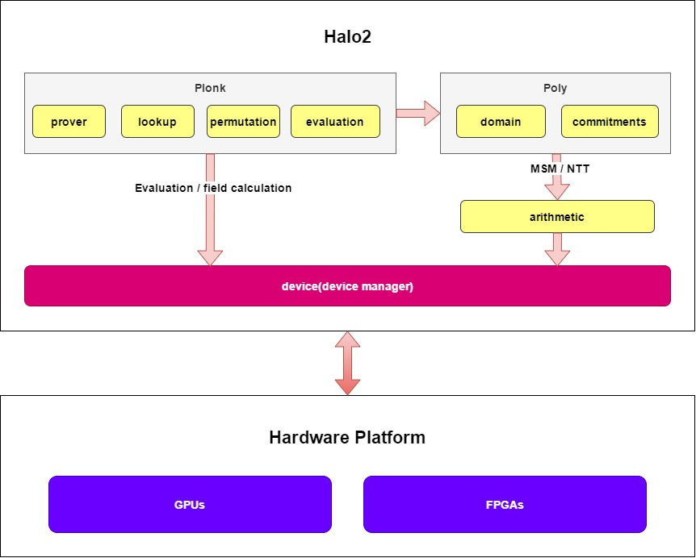

# Introduction


## Purpose
*  To develop a module similar to the HAL (Hardware Abstraction Layer) that is compatible with various hardware types, allowing users to focus solely on the application layer. This module provides a unified interface, enabling Halo2 to invoke hardware acceleration for modules such as MSM and NTT.
*  To facilitate the management and scheduling of multiple hardware types and devices.
*  To seamlessly integrate into the framework of Halo2, making it easy to incorporate within the Halo2 ecosystem.


## Architecture Diagram for Device Manager and Halo2 



* Location in Halo2 project
```
  halo2/halo2_proof/src/device
```
* Make it easily accessible for internal modules of halo2_proof.


## Functions
* Initialization, including hardware initialization and parameter initialization.
* Execution of the core computational process.
* Deinitialization to release hardware resources.
* Querying current device information, including device type, device status, and device memory usage.
* Device scheduling, determining which type of device each computing unit should use. The provided reference code is currently set to use GPUs.


## Interfaces
### Initialization
```Rust
    pub fn init(
        &mut self,
        init_device_unit_type: DeviceInitUnitType,
        param_id: Option<usize>,
        bases: Option<&[&[u8]]>,
        omega: Option<&[u8]>,
    ) -> Result<(), DeviceManagerError> 
```
* It can specify the initialization of computational units, such as MSM and NTT. In most cases, the bases for MSM are fixed and need to be passed in only once during initialization, similarly, the omega for NTT is also fixed.
Since different circuits generally have different parameters (param) and bases, we have introduced a param ID to distinguish them. The device manager can simultaneously manage multiple params and bases.

* It can also specify separate initialization for MSM, NTT, or MSM+NTT by using the DeviceInitUnitType.

### Execute functions
``` Rust
    pub fn execute_msm<C: CurveAffine>(
        &mut self,
        msm_param_id: usize,
        bases_index: usize,
        scalars: &[C::Scalar],
    ) -> Result<Vec<u8>, DeviceManagerError> 
```
* Every time an MSM calculation is performed, only the ID of the bases and scalars data need to be provided. 


``` Rust
    pub fn execute_ntt<Scalar: Field, G: FftGroup<Scalar>>(
        &mut self,
        scalars: &mut [G],
        log_n: u32,
    ) -> Result<(), DeviceManagerError> 
```
* Every time an NTT calculation is performed, scalars and log_n need to be passed in.

### Deinit
``` Rust
    pub fn deinit(&mut self) -> Result<(), DeviceManagerError>
```
* Release all hardware resources.

### Some query interfaces
* Give an example：
``` Rust
    pub fn get_gpu_device_infos(&mut self) -> Result<Vec<DeviceGPUInfo>, DeviceManagerError> 
```

## Data Formats
* The underlying data structure for MSM and NTT is a "Field," and the device manager transfers these fields between the CPU and devices in a byte stream format.
* The advantage of this approach is twofold. On one hand, for hardware, passing Fields to the hardware is equivalent to transmitting a byte stream, rather than complex data structures. This is more hardware-friendly in terms of design and definition. On the other hand, for hardware manufacturers, this approach not only allows compatibility with the Halo2 framework but also enables compatibility with other algorithm frameworks.
* Take MSM as an example:
  In init function, bases is type u8.
```Rust
    pub fn init(
        &mut self,
        init_device_unit_type: DeviceInitUnitType,
        param_id: Option<usize>,
        bases: Option<&[&[u8]]>,
        omega: Option<&[u8]>,
    ) -> Result<(), DeviceManagerError> 
```
   Before calling device execution functions, scalars need to be converted to bytes.
``` Rust
    // Convert scalars to bytes using transmute_values
    let scalars_bytes = transmute_values(scalars.as_ref().as_ref());

    // Call panda_msm_bn254_gpu and unwrap the result
    let mut msm_result = panda_msm_bn254_gpu(gm, scalars_bytes, bases_index).unwrap();
```

    After execution, the result of the calculation is also of type u8。
``` Rust
    // Create a vector to hold G1 values with the desired capacity
    let mut values = Vec::<G1>::with_capacity(MSM_EXECUTION_RESULT_NUM);

    // Get pointers to the vectors' data
    let values_ptr = values.as_mut_ptr() as *mut u8;
    let msm_result_ptr = msm_result.as_mut_ptr();
    let size = std::mem::size_of::<u8>() * msm_result.len();

    // Copy `msm_result` into `values`
    unsafe {
        std::ptr::copy_nonoverlapping(msm_result_ptr, values_ptr, size);
    }
```

### Types
* Support device type, GPU, FPGA:
``` Rust
    pub enum DeviceType {
        DeviceTypeNone,
        DeviceTypeGPU,
        DeviceTypeFPGA,
    }
```

* Support device computation unit type, MSM, NTT, etc：
``` Rust
    pub enum DeviceUnitType {
        DeviceUnitTypeNone,
        DeviceUnitTypeMSM,
        DeviceUnitTypeNTT,
    }
```

* Support device status type：
``` Rust
    pub enum DeviceStatusType {
        DeviceStatusNone,
        DeviceStatusIdle,
        DeviceStatusReady,
        DeviceStatusRunning,
    }
```


